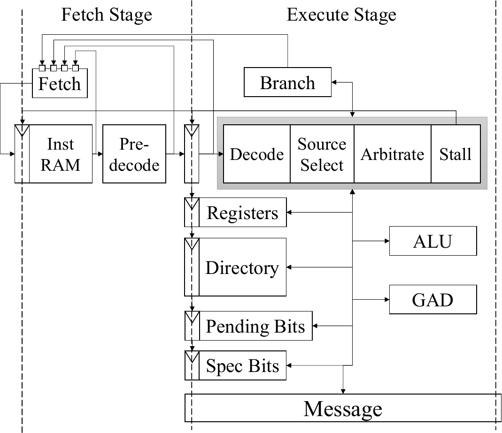

# BedRock Microarchitecture Guide

This document details the microarchitecture of the BedRock Programmable CCE (ucode CCE). For
a general overview of the BedRock coherence protocol and system, please see the general
[BedRock guide](bedrock_guide.md).

## Ucode CCE

The BedRock Programmable CCE (ucode CCE) is a two-stage fetch and execute microcoded engine.
It executes an ISA that contains both RISC-style general purpose operations and coherence-specialized
operations that are more complex in nature, but greatly accelerate common cache coherence operations.
Most instructions execute in a single cycle, although some may take more than one cycle, for example
reading the coherence directory or sending and receiving messages. The fetch stage contains static
branch prediction logic that quickly decodes a statically assigned branch predict bit attached to
each instruction and redirects the fetch unit (speculatively) to the branch target if the predict
taken bit is set. The execute stage handles all instruction execution and branch resolution. A
branch mispredict results in a one cycle mispredict penalty with the incorrectly fetch instruction
being squashed in execute the following cycle and the fetch unit being redirected to the branch
resolution target.

The ucode CCE contains 8 64-bit general purpose registers (GPRs), a miss status handling register
(MSHR) to track the current request it is processing, and coherence network ports for sending and
receiving messages on the three BedRock protocol networks. The CCE also contains dedicated coherence
directory storage, speculative memory access tracking storage, and pending bit storage. Instructions
may typically access the general purpose registers, MSHR, and selected other internal signals (such
as message port valid or ready signals and inbound message header or data fields) when executing as
specified by the microcode instruction.

The following subsections describe selected components in more detail. The diagram below provides
a high-level overview of the ucode CCE microarchitecture functional units.

### Fetch and Branch Predict

The fetch stage contains the fetch PC register, microcode RAM, and branch prediction logic.
The fetch PC is speculative and runs ahead of the execute stage's PC by a single instruction at most.
During normal operation, the fetch stage's branch prediction logic examines the branch and predict
taken bits attached to the instruction read from the microcode RAM and then statically predicts the
next instruction to fetch (either next sequential instruction or the branch target). A mispredicted
branch is resolved in the execute stage by the branch unit and results in the incorrectly
fetched instruction being squashed the following cycle in execute and the fetch unit being redirected
to the correct PC. The execute unit may also stall the fetch unit, causing it to refetch the current
fetch PC, in the event that the instruction in execute must stall due to a hazard or stall
condition.

### Decode and Stall

The decode unit takes as input the 32-bit microcode instruction and decodes it into a wider
internal format that contains control signals for all of the functional units. The decode unit
outputs the intent of the microcode instruction, but does not account for functional unit hazards
or resource availability.

The stall unit examines the current instruction and the status of all functional units and
other resources (e.g., message ports) to determine if the instruction is able to execute in the
current cycle. In the event that a resource is unavailable and required by the current instruction
the stall unit asserts a stall signal that prevents any changes to the architectural state of
the CCE. The message and directory units may also assert busy signals that stall all instructions
until the unit finishes its current operation. The two most common cases are when the directory
is performing a read that takes multiple cycles or when the message unit is sending invalidation
messages to LCEs. The stalling instruction is held in the execute stage and replayed the next cycle.
An instruction may stall for multiple cycles if a stall condition exists in consecutive cycles.

### Message Unit

The message unit handles all sending and receiving of messages on the BedRock coherence networks.
It can operate in two modes, an uncached only mode or a normal operation mode. The uncached only
mode is the default mode and is used post-restart until the BlackParrot configuration module
loads the ucode CCE's microcode and directs it to switch modes to normal operation. In uncached
only mode, the ucode CCE does not enforce cache coherence and treats all requests as uncached
accesses.

In normal operation mode, the microcode engine controls the sending and receiving of many
messages. There is an additional configuration bit that can be set to enable an auto-forwarding
mechanism for a subset of the coherence messages. When the auto-forward bit is set, the message
unit automatically handles some messages without requiring the microcode to process the message.
This functionality is used to forward memory responses (i.e., cache block data) from memory
to the LCEs and to sink coherence acknowledgement response messages, for example. The auto-forward
functionality significantly improves performance of the microcode CCE and greatly increases
the amount of concurrency between independent coherence requests.

### Pending Bits

Each Way Group has an associated Pending Bit that is used to order coherence requests for
collections of related addresses. In practice, the pending bit is implemented as a small counter.
This counter is incremented when the CCE begins processing a new request and when the CCE sends
a command to memory while processing the request. The counter is decremented when the CCE
receives and processes responses from memory and the coherence acknowledgement from the LCE. The
protocol makes no assumptions about the latency of messages between the LCEs and CCEs or the CCEs
and memory, and a transaction is only complete when all memory commands have been completed and
the LCE has responded with a coherence acknowldegement.

Optimized CCE implementations use the pending bits to allow concurrency among independent accesses,
while preserving order between potentially conflicting accesses. The CCE must only
ensure that all LCEs are in a coherent state before moving on to the next request. This allows
the CCE to set each LCE into its correct new state, except for the requesting LCE, issue any
memory commands for access or writeback or issue a transfer command, and then move on to a new
request. For example, in the case of a cache to cache transfer and a writeback from the previous
owner LCE, the CCE must only wait for the writeback response from the previous owner and send it
off to memory before moving on to a new request. The CCE does not need to stall waiting for
memory to acknowledge the writeback completing or for the requesting LCE to respond with a
coherence acknowledgement message indicating it has received the transfer data. When these
messages eventually arrive at the CCE, they contain enough information for the CCE to process them
and decrement the pending bit appropriately, without maintaining any MSHR information for the
initial request. In this way, the CCE can move on and process and independent request
while waiting for memory or the LCE to finish the transaction.

### Directory and GAD

The coherence directory is organized as a full duplicate or shadow tag directory. However, it is
the CCE, not the LCEs, that maintain the golden copy of tags and coherence state. The CCE
exclusively manages all coherence actions in the system.

The coherence directory is divided into segments, with each segment tracking the coherence information
for a specific type of LCE. Each type of LCE must have the same cache organization (sets and
asssociativity), and all LCE types currently must use the same block size. In the current
BlackParrot design, the directory has three segments: one for the instruction caches, one for
the data caches, and one for accelerator caches. Each directory segment contains a 1RW synchronous
SRAM that holds one or more tag sets for each LCE of its type. By default, two tag sets are stored
per physical directory row and a directory read may require multiple cycles to read the tag sets
of all LCEs. For example, in a 4-core BlackParrot system, Tag Set 0 is stored across two rows with
the tag sets from cores 0 and 1 on the first row and tag sets from cores 2 and 3 on the second row.
The number of tag sets stored per directory row is parameterizable and the current value is selected
based on PPA tradeoffs for the directory SRAMs.

On a coherence directory read, the tag set data is compared to the current request's address
to determine which LCEs have copies of the block including the state and cache set way the block
is cached in. This information is output in a condensed form as the sharer's vectors, which indicate
per LCE if the block is cached, its state, and the cache set way.

The sharer's vectors are processed by the GAD, Generate Auxiliary Directory information, unit that
outputs a set of control flags to be used by the microcode. These control flags indicate if the
target block is cached in any of the MOESIF states and if there is an owning LCE, which LCE it is
and the exact location of the block at that LCE. The GAD unit also outputs a flag indicating if
the requesting LCE requires a cache block replacement to satisfy the request and a flag indicating
if a write request is actually an upgrade request requiring only a coherence permission change as
opposed to new coherence permissions and a cache block fetch or transfer.

## Microcode

The BedRock programmable Cache Coherence Engine is a microprogrammed machine. Its microcode defines
the coherence protocol enforced by the coherence engine and directory, as well as any additional
functionality enabled by the implementor. BedRock's microcode can be described in two parts, a
RISC-like base ISA and a coherence-specialized ISA. The base ISA contains standard instructions
for data movement and program control flow, common to a general purpose RISC ISA. The
coherence-specialized ISA contains a variety of instructions designed to accelerate cache coherence
operations in the CCE. A number of these instructions are complex in nature, but most require only
a single cycle to execute. Microcode instructions are 32-bits wide and tagged with two additional
bits to enable fast branch detection and prediction in the fetch state, which are the branch
and predict taken bit.

